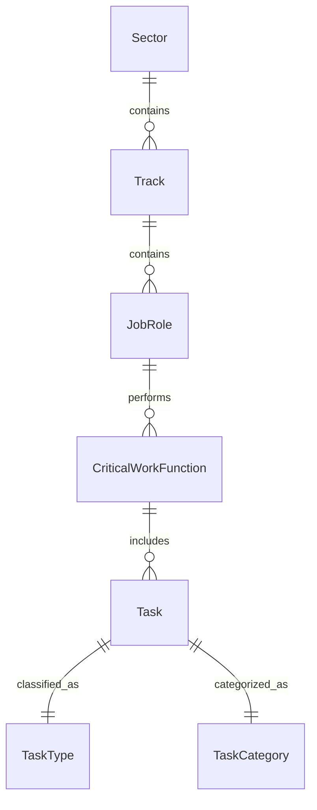

# Logical Data Model

## Entities and Attributes
- **Sector**
  - sector (string): Name of the sector
- **Track**
  - track (string): Name of the track within sector
- **JobRole**
  - jobrole (string): Name of the job role
- **CriticalWorkFunction**
  - critical_work_function (string): Description of the work function
- **Task**
  - task (string): Description of the task
  - task_type (string): Type of the task
  - task_category (string): Category of the task
- **Metadata**
  - sub_institute_id (int): ID of sub-institute
  - created_by (int): User ID who created
  - created_at (datetime): Creation timestamp

## Relationships
- A **Sector** contains multiple **Tracks** (1:N)
- A **Track** contains multiple **JobRoles** (1:N)
- A **JobRole** has multiple **CriticalWorkFunctions** (1:N)
- A **CriticalWorkFunction** has multiple **Tasks** (1:N)
- Each **Task** has one **TaskType** and one **TaskCategory** (1:1)

## ER Diagram

## Notes
- The current dataset is flat/denormalized.
- For a relational database, normalize into separate tables with foreign keys.
- Primary keys can be auto-generated IDs; foreign keys link entities.